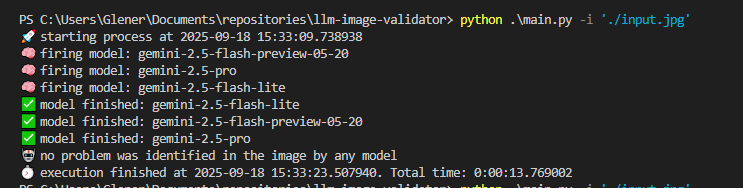
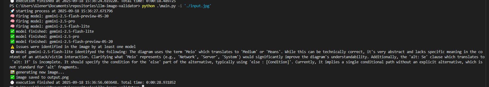

# **llm-image-validator**

<p align="center"> 🚀 This script is designed to validate technical images such as diagrams and flowcharts using different LLM models and generate a new image correcting any identified issues.</p>

Example of execution without issues:



Example of execution with issues:



Check the generated image fixed the identified issues [`docs/image_with_issues_solved`](docs/image_with_issues_solved.png) and the input image with issues in [`input.jpg`](input.jpg)

<h3>🏁 Table of Contents</h3>

<br>

===================

<!--ts-->

💻 [Dependencies and Environment](#dependenciesandenvironment)

☕ [Using](#using)

👷 [Author](#author)

<!--te-->

===================

<div id="dependenciesandenvironment"></div>

## 💻 **Dependencies and Environment**

**Gemini**: This project uses the paid Google Gemini API, it's necessary to [configure a valid Gemini API Key](https://aistudio.google.com/apikey). Ensure you have a `.env` file with the environment variable **API_KEY_GEMINI** and linked billing account.

**OpenAI**: This project uses the paid OpenAI API, it's necessary to [configure a valid OpenAI API Key](https://platform.openai.com/settings/organization/api-keys). Ensure you have a `.env` file with the environment variable **API_KEY_OPENAI** and linked billing account.

<div id="using"></div>

## ☕ **Using**

First, check the [dependencies](#dependenciesandenvironment) process

Check [`Makefile`](Makefile) to made operations like clear environment, execute tests, lint and format files.

To setup environment use (you will need [venv](https://docs.python.org/pt-br/3.13/library/venv.html)):

```
$ make setup
```

And enable the virtual ambient using:

```
$ source .venv/bin/activate
```

You can run using the script

```
$ python3 main.py -i './input.jpg'
```

Or using makefile:

```
$ make run ARGS="-i \"./input.jpg\""
```

Check the required and optional parameters in the [`src/args.py`](src/args.py) file.

<div id="author"></div>

#### **👷 Author**

Made by Glener Pizzolato! 🙋

[](https://www.linkedin.com/in/glener-pizzolato-6319821b0/)
[](mailto:glenerpizzolato@gmail.com)
